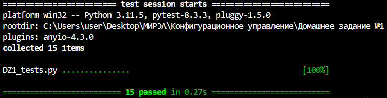

### 1. **Общее описание**
Этот проект состоит из двух основных файлов: `DZ1_GUI.py` и `DZ1_tests.py`. 

Файл `DZ1_GUI.py` реализует терминал с интерфейсом на базе библиотеки Tkinter, позволяющий пользователю взаимодействовать с содержимым ZIP-архива через набор команд. Эти команды включают навигацию по архиву, просмотр содержимого файла, удаление файла и вывод сообщения.

Файл `DZ1_tests.py` содержит набор тестов для проверки функциональности команд, реализованных в `DZ1_GUI.py`. Тесты запускают сценарии для проверки работы команд, таких как `ls`, `cd`, `cat`, `echo`, `rm` и другие.

### 2. **Описание всех функций и настроек**
#### Файл `DZ1_GUI.py`:
- **`open_yaml()`**  
  Читает аргумент archive_path в файле с расширением yaml и возвращает содержимое аргумента:
  - `archive_path` — имя пользователя,

- **`command(cmd=None)`**  
  Выполняет команды, введенные пользователем:
  - `ls` — выводит содержимое текущей директории в архиве,
  - `exit` — завершает программу,
  - `cd <path>` — меняет текущую директорию,
  - `cat <file>` —  просмотр содержимого файла,
  - `rm <file>` — удаление файла,
  - `echo` — выводит сообщение, написанное пользователем.

- **`echo`**  
  Выводит в консоль написанное сообщение.

- **`rm(path)`**  
  Удаляет файл по указанному пути.

- **`cat(path)`**  
  Выводит в консоль содержимое файла, указанного в пути.

- **`ls(name_list)`**  
  Выводит содержимое текущей директории архива, включая файлы и папки.

- **`cd(path)`**  
  Меняет текущую директорию в архиве. Поддерживаются команды для перехода в корень и в поддиректории.

- **`updateLabel()`**  
  Обновляет метку, отображающую текущую директорию или возвращает текст, если интерфейс не используется.

- **`write(text="")`**  
  Выводит текст в текстовое поле интерфейса или возвращает текст, если интерфейс не используется.

- **`clear()`**  
  Очищает текстовое поле интерфейса.

#### Файл `test_task_1.py`:
- **Тестовые функции**  
  Набор функций для тестирования каждой функции программы:
  - `test_yaml` проверяет корректность открытия файла с расширением yaml и правильность передаваемых значений,
  - `test_ls()`, `test_ls_empty()`, `test_command_ls()` и `test_command_ls_empty()` тестируют команду `ls` с корректными и некорректными параметрами,
  - `test_cd()`, `test_cd_invalid_path()`, `test_command_cd()` и `test_command_cd_invalid()` тестируют команду `cd` с корректными и некорректными параметрами,
  - `test_cat()` и `test_command_cat()` проверяют вывод содержимого файда,
  - `test_rm()` и `test_command_rm()` тестируют удаление файлов.
  - 
### 3. **Описание команд для сборки проекта**

Проект не требует отдельной сборки, так как написан на Python. Команды для запуска скриптов:

1. Для запуска основного скрипта `DZ1_GUI.py`:
   ```
   py DZ1_GUI.py
   ```

2. Для запуска скрипта с тестами `DZ1_tests.py`:
   ```
   python -m pytest DZ1_tests.py
   ```
   Этот скрипт запускает все тесты, проверяющие функциональность команд.

### 4. **Результаты прогона тестов**

